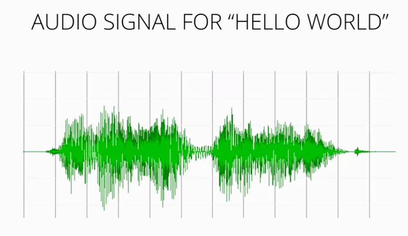
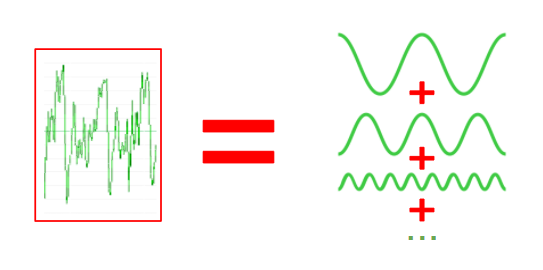
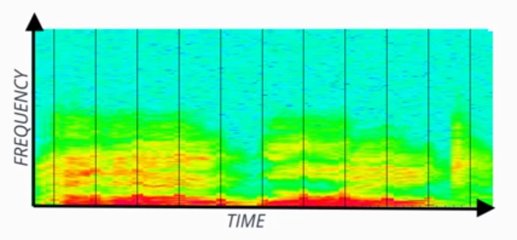
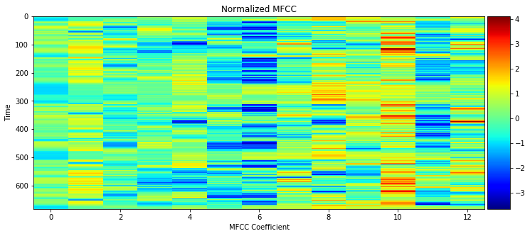
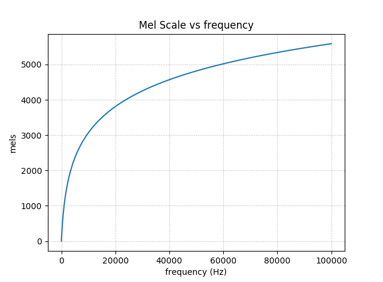
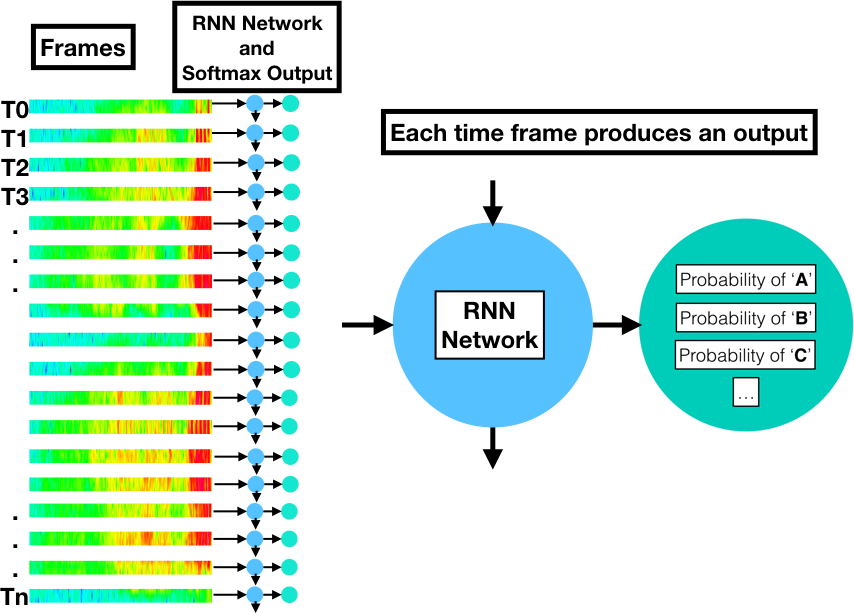

# End to End Speech Recognition
This repository provides you the details of how speech recognition is done from end to end.

## Requirements:
To install the required python module please run the commmand below.  It is recommended to create an environment thus it doesn't conflict with other packages. If conda is not installed please use the link for instalation: https://www.anaconda.com/download/#linux

	pip install -r requirements.txt
	
## Data:
LibriSpeech ASR corpus data is available freely at http://www.openslr.org/12/. To download and preprocess the data please follow the instructions below.
	
	git clone https://github.com/oucler/NLND-End2End-Speech-Recognition.git
	
	cd NLND-End2End-Speech-Recognition
	
	wget http://www.openslr.org/resources/12/dev-clean.tar.gz
	tar -xzvf dev-clean.tar.gz
	wget http://www.openslr.org/resources/12/test-clean.tar.gz
	tar -xzvf test-clean.tar.gz
	mv flac_to_wav.sh LibriSpeech
	cd LibriSpeech
	./flac_to_wav.sh
	
	cd ..
	python create_desc_json.py LibriSpeech/dev-clean/ train_corpus.json
	python create_desc_json.py LibriSpeech/test-clean/ valid_corpus.json

## Background:
This section provides you general information about the components needed for the End to End Speech Recognitions. Entire diagram end to end flow as shown below.

### Feature Extractions:

#### Audio Signal:
When we speak sound vibrations cause pressure waves in the air that can be detected with a microphone and transduced into a signal. A sample audio signal is shown below.

Detailed coverage of the topic as related to Speech Recognition can be found in the following: http://web.science.mq.edu.au/~cassidy/comp449/html/ch03.html

#### Fourier Analysis:
Fourier Analysis is the study decomposing mathematical functions into sums of simpler trigonometric functions. Since sound is comprised of oscillating vibrations, we can use Fourier analysis, and Fourier transforms to decompose an audio signal into component sinusoidal functions at varying frequencies. Here is a representation of an audio signal decomposed with multiple sinusoidal signals.

The following website explains the process: https://ibmathsresources.com/2014/08/14/fourier-transforms-the-most-important-tool-in-mathematics/

#### Spectrograms:

A spectrogram is the frequency domain representation of the audio signal through time. It's created by splitting the audio signal into component frequencies and plotting them with respect to time. The intensity of color in the spectrogram at any given point indicates the amplitude of the signal.  HelloWorld representation in spectrogram format is shown below.

Lecture notes about Spectrogram can be found here:
http://www.seas.upenn.edu/~cis391/Lectures/speech-rec.pdf

#### Mel-frequency cepstral coefficients (MFCCs):
In sound processing, the mel-frequency cepstrum (MFC) is a representation of the short-term power spectrum of a sound, based on a linear cosine transform of a log power spectrum on a nonlinear mel scale of frequency.

Mel-frequency cepstral coefficients (MFCCs) are coefficients that collectively make up an MFC. They are derived from a type of cepstral representation of the audio clip (a nonlinear "spectrum-of-a-spectrum"). The difference between the cepstrum and the mel-frequency cepstrum is that in the MFC, the frequency bands are equally spaced on the mel scale, which approximates the human auditory system's response more closely than the linearly-spaced frequency bands used in the normal cepstrum. This frequency warping can allow for better representation of sound, for example, in audio compression.

MFCCs are commonly derived as follows:

-	Take the Fourier transform of (a windowed excerpt of) a signal.
-	Map the powers of the spectrum obtained above onto the mel scale, using triangular overlapping windows.
-	Take the logs of the powers at each of the mel frequencies.
-	Take the discrete cosine transform of the list of mel log powers, as if it were a signal.
-	The MFCCs are the amplitudes of the resulting spectrum.

Image as follow shows a sample MFCC presentation of a sound.

##### Mel Scale
Human can't hear signals above certain frequencies and can't tell the difference at certain frequencies. Mel Scale was developed based on that concept. 

More details on MFCC can be found:
http://www.speech.cs.cmu.edu/15-492/slides/03_mfcc.pdf
http://practicalcryptography.com/miscellaneous/machine-learning/guide-mel-frequency-cepstral-coefficients-mfccs/

### Acustic Model:
The input data in speech recognition is a sequence of observations in the form of frame vectors from regular time intervals. The desired output is a series of symbols: phonemes, graphemes, or words. The basic problem is that the number of frames does not have a predictible correspondence to the number of the output symbols. For example, if we assume 20ms per frame, the following audio signals of the word "speech" spoken at two different speeds have about 300 frames in the first example and something like 850 frames in the second example, yet they should both be decoded as the six-letter word, "speech".

#### Recurrent Neural Network(RNN):
A Recurrent Neural Network (RNN) produces a probability distribution of output symbols for each frame. Suppose we want to train an RNN network to recognize 26 different letters plus an apostrophe, space, and blank (29 graphemes). There will be a softmax layer output that produces a probability distribution for these possibilities. Each frame will produce one of these probability distribution vectors. If the utterance has 300 observations, there will be 300 RNN softmax vectors. If the utterance consists of 850 observations, there will be 850 vectors.

More information about RNN can be found here: https://deeplearning4j.org/lstm.html
 

### Decoding:

#### Phoneme:
In any given language, a phoneme is the smallest sound segment that can be used to distinguish one word from another. For example "bat" and "chat" have only one sound different but this changes the word. The phonemes in question are "B" and "CH". What exactly these are and how many exist varies a bit and may be influenced by accents included. Generally, US English consists of 39 to 44 phonemes.

#### Lexicon:
A lexicon for speech recognition is a lookup file for converting speech parts to words. Here is example.

	AARDVARK    AA R D V AA R K
	AARON    EH R AH N
	AARON'S    EH R AH N Z
	AARONS    EH R AH N Z
	AARONSON    EH R AH N S AH N
	AARONSON'S    EH R AH N S AH N Z
	AARONSON'S(2)    AA R AH N S AH N Z
	AARONSON(2)    AA R AH N S AH N
	
#### ARPAbet:
A set of phonemes developed by the Advanced Research Projects Agency(ARPA) for the Speech Understanding Project (1970's).

| Phoneme 	| Example  | Translation
| ----------------- | :----------:  |--------------:|
|AA |odd |AA D
|AE|	at| AE T
|AH|	hut|	HH AH T
|AO|	ought|AO T
|AW |cow|K AW
|AY| 	hide|HH AY D
|B| 	be| 	B IY
|CH|	cheese|	CH IY Z
|D|	dee|	D IY
|DH|	thee|DH IY
|EH| Ed| 	EH D

#### Connectionist Temporal Classification (CTC):
A Connectionist Temporal Classification (CTC) loss function can be calculated to train the network. When combined with the CTC decoding algorithm over the softmax output layer, the sequence-to-sequence transformation is achieved. The details of how this works are in the seminal paper on CTC by Alex Graves: http://machinelearning.wustl.edu/mlpapers/paper_files/icml2006_GravesFGS06.pdf

##### CTC Decoding:
Extracting the most likely symbol from each softmax distribution will result in a string of symbols the length of the original input sequence (the frames). However, with the CTC training, the probable symbols have become consolidated. The CTC decoding algorithm can then compress the transcription to its correct length by ignoring adjacent duplicates and blanks.

A more complex CTC decoding can provide not only the most likely transcription, but also some number of top choices using a beam search of arbitrary size. This is useful if the result will then be processed with a language model for additional accuracy.

### Language Modeling:
One of the problems in the Speech Recognition is that some of the words sound the same but spell different such as "HEAR" or "HERE". To overcome this issue language models are used to determine probability of words followed by previous words.

#### N-Grams:
N-Grams provide a way to constrain a series of words by chaining the probabilities of the words that came before. For more on creating and using N-Grams, see the references below:
https://lagunita.stanford.edu/c4x/Engineering/CS-224N/asset/slp4.pdf
http://web.stanford.edu/class/cs124/lec/languagemodeling2016.pdf

## References:
1- [Traditional ASR](https://www.google.com/url?sa=t&rct=j&q=&esrc=s&source=web&cd=1&cad=rja&uact=8&ved=0ahUKEwjMtPu2vtfUAhWF6IMKHQIHDW0QtwIIJjAA&url=https%3A%2F%2Fwww.youtube.com%2Fwatch%3Fv%3DPJ_KCTsOCrs&usg=AFQjCNFVClgb-77HLUdZBhZjSDax7AYtAg) 
2- [CTC Implementation](https://github.com/baidu-research/warp-ctc)
3- [End to end speech recognition github repo ](github.com/baidu-­‐research/ba-­‐dls-­‐deepspeech)

